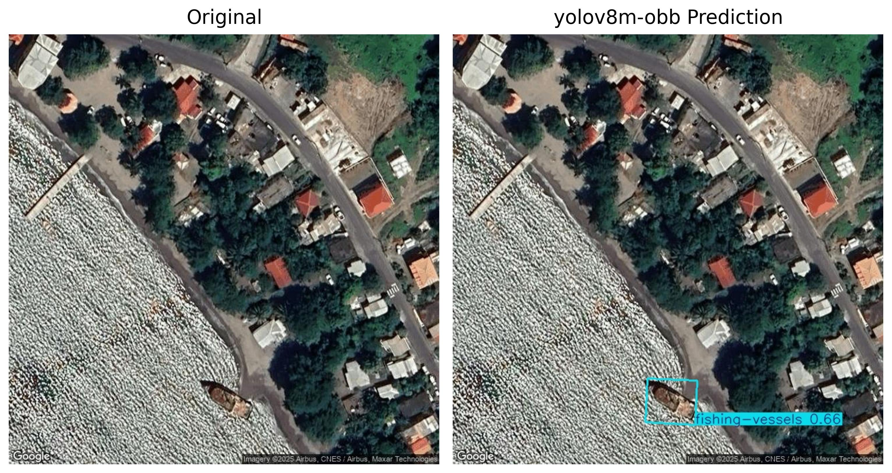

# Caribbean Vessel Detection - YOLOv8m-OBB Custom Model

## Project Overview
This repository contains resources for detecting vessels in the Caribbean region using a custom **YOLOv8m-OBB model**. The goal is to support FAO initiatives such as vessel monitoring, national vessel registry updates, and maritime research.  

The repository contains:

- **Code** for training, inference, and evaluation of the model.
- Folder structure to organize results, models, and scripts.
- Links to large files hosted externally on Dropbox.

---

## Folder Structure on GitHub


> Large files are stored on Dropbox for easy access and to keep this repository lightweight.

---

## Large Files (Dropbox)

### 1. Model Weights
**File:** `best.pt`  
**Description:** Trained YOLOv8m-OBB model for vessel detection. Use this file to run inference or fine-tune the model.

**Download link:** [(https://www.dropbox.com/scl/fi/lh385t61iee52r4d3hyo0/best.pt?rlkey=7gsyw8qo3dpkxc2uueyf8ba6e&st=z9fufaa6&dl=0)]

---

### 2. Vessel Annotations
**File:** `Vessel Object Detection.v9i.yolov8-obb`  
**Description:** RoboFlow export containing the annotated dataset split into **train, validation, and test sets**. Includes all labeled vessel objects needed for training.

**Download link:** [(https://www.dropbox.com/scl/fi/x5zsrg8xccvwrom59ap2p/Vessel-Object-Detection.v9i.yolov8-obb.zip?rlkey=4erqlk7aege8cmi5okzzskm53&st=x799v5d6&dl=0)]

---

### 3. Test Metrics and Predictions
**File:** `test-metrics-yolov8m-obb.zip`  
**Description:** Contains evaluation outputs automatically generated during `model.predict` on the test set:  
- Confusion matrices  
- Batch prediction images  
- Performance graphs  

**Download link:** [(https://www.dropbox.com/scl/fi/gdfxkcltw198e5zc2u181/test-metrics-yolov8m-obb.zip?rlkey=827eicr2zaizlr50t1990cok4&st=5v1sky2m&dl=0)]

---
## Results Gallery

Below are sample images from the **results/** folder:





---

## Usage

### Using with Ultralytics YOLOv8

You can use this model like any other YOLOv8 model from Ultralytics. Example:

```python
from ultralytics import YOLO

# Load your fine-tuned model
model = YOLO("path_to_best.pt")

# Run prediction on an image
results = model.predict("example_image.jpg", imgsz=640, conf=0.25, task= "obb")

# Print results
results.print()

# Optionally save predictions to disk
results.save()
```

## Training

Use the Vessel Object Detection.v9i.yolov8-obb dataset and data.yaml to train or fine-tune the model.

Training scripts are located in the code/ folder.

## Example of data.yaml format (for reference):

```yaml
train: train/images
val: valid/images
test: test/images

names: 
  0: catamaran
  1: fishing-vessels
  2: other vessels
  3: private_yachts
  4: recreational boat
```

## Notes

Ensure all large files are downloaded from Dropbox links before running inference or training.

GitHub folders (model/, results/) can contain small preview files or placeholders.

Test metrics folder contains automatically generated images from model.predict (Ultralytics standard behavior).

## Citation

If using this model or dataset in your research, please cite:
Sofiya Tumanova, 2025

For the base YOLOv8 model, please also acknowledge Ultralytics:
Ultralytics YOLOv8, Glenn Jocher et al., https://github.com/ultralytics/ultralytics
